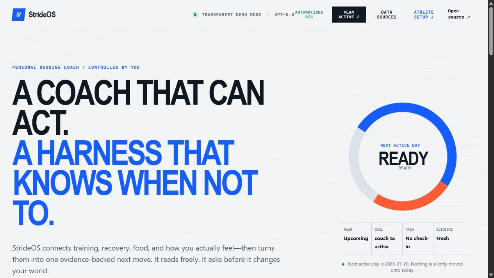
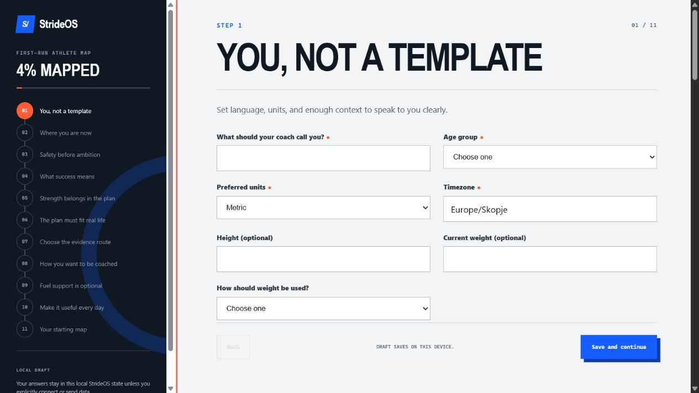
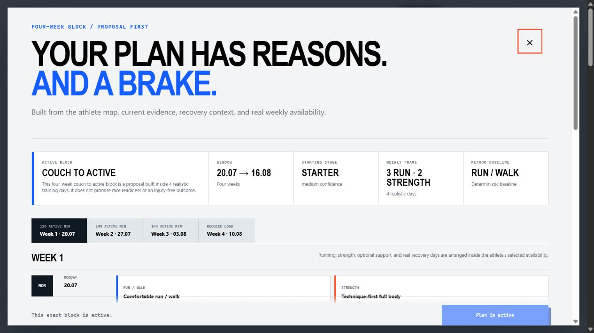
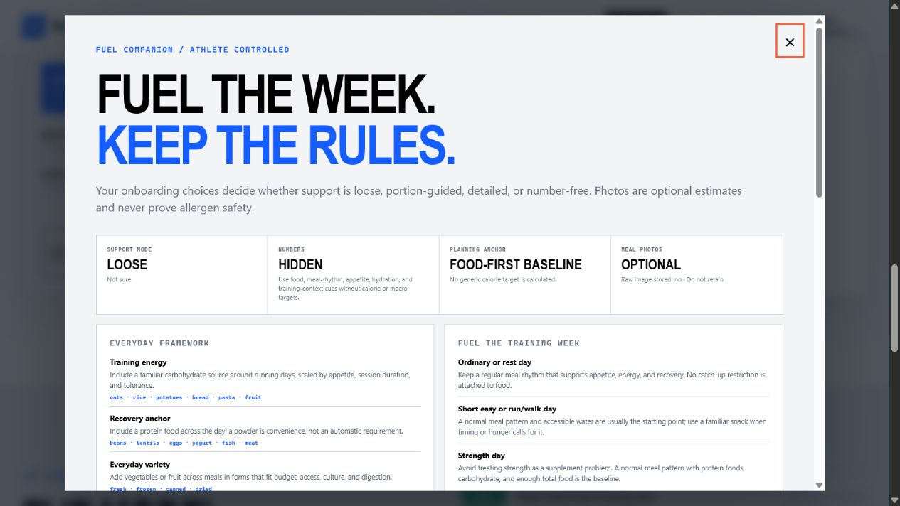

# StrideOS

> A coach that can act. A harness that knows when not to.

StrideOS is an open-source, rule-governed personal coaching harness for runners and people who want to become active. It begins with a real athlete onboarding, combines training signals, strength experience, subjective feedback, schedule constraints, and optional meal images into evidence-backed recommendations, then checks every intended action against an inspectable policy before anything changes.



Built from scratch for **OpenAI Build Week 2026** with Codex and GPT-5.6.

## Why this is a harness

Most AI fitness products stop at chat, or quietly turn a confident answer into an action. StrideOS separates the system into a visible control loop:

1. **Sense** — authorized Garmin-style training data, recovery signals, food images, pain, and RPE.
2. **Reason** — GPT-5.6 produces schema-constrained evidence and a proposed action.
3. **Gate** — deterministic, versioned rules outside the model decide whether the action is autonomous, requires approval, or must stop.
4. **Act** — approved actions move to an integration adapter; declined actions change nothing.

The **decision ledger** makes this loop visible to the athlete and to judges.

## Run it

Requires Node.js 20 or newer. From a clean clone, one command installs the locked dependency, runs the setup doctor, and starts the local server:

```bash
npm run setup
```

Open <http://localhost:4173>. With no environment variables, the full interface runs in deterministic **judge demo mode** with synthetic data.

### ChatGPT Work + Sites path

The intended everyday user does not need to live in Codex or configure Vercel. Codex is the build surface; the runner uses StrideOS in **ChatGPT Work**. The conversation performs onboarding, explains the evidence, proposes a plan, collects subjective feedback, and asks for approvals. **ChatGPT Sites** is the optional visual companion: a private, shareable athlete dashboard that can be opened on phone or desktop and invited to a human coach.

The open-source [Sites athlete-and-coach demo](sites/athlete-coach-demo) shows that target experience with an explicitly synthetic 3:20 marathon runner. It includes a first-run replay, current-day card, weekly plan, athlete annotation, coach feedback, an exact revision diff, athlete-only approval, and responsive navigation. It is an unbound template: every installer creates their own Site rather than inheriting the project author's deployment.

The current Sites template is a product mock, not yet the durable multi-user backend. Its role switch, comments, and approval interaction reset on refresh. Real shared comments require Sites identity, a private coach allowlist, and D1 persistence; the permission contract is specified in [ChatGPT Work and Sites](docs/CHATGPT_SITES.md). The local server remains the authoritative reference implementation for policy, approval, nutrition, connectors, and external-action boundaries.

Later starts use `npm start`. Windows users can run `npm.cmd run setup`; macOS and Linux use the same `npm run setup` command. See the complete [clean-clone install guide](docs/INSTALL.md), including port, environment, persistent-state, reset, and troubleshooting details. No watch, account, database, or API key is required.

On the first launch, StrideOS opens the athlete-map onboarding. It asks about current movement, running history, safety, goals, strength experience and equipment, real-life schedule, data sources, coaching preferences, optional nutrition, and delivery. A watch is not required. Draft answers save locally, and the final review shows starting stage, deadline pressure, declared-versus-observed load, available time, recovery context, missing evidence, confidence, strength guidance, connector truth, and any safety gate before a plan is created.

After onboarding, **Training plan** opens a deterministic four-week proposal built around the athlete's stage, goal, availability, recovery context, and strength experience. Every session explains its duration and intensity, week four reduces load, missed sessions never create catch-up stacking, and named advanced methods remain behind a suitability-research gate. Previewing changes nothing; the exact plan becomes active only after the athlete approves its server-recorded decision.

The **athlete dashboard** then projects only server-authoritative state: today's approved session or an honest empty/upcoming state, current-week running and strength load, recovery feedback, observed activity, goal window, optional fuel mode, and source freshness. Pending plans never masquerade as active workouts, and observed files never silently become claimed plan completion. No synthetic readiness score is substituted for a real athlete.

The **Coach's margin** makes the dashboard two-way. Attach keep, adjust, move, or cannot-do feedback directly to the exact approved session, add the practical reason and optional pain score, then ask the coach for a revision. StrideOS creates an exact revised block—shorter, easier, moved, swapped, or cancelled—and puts it in the decision ledger. The current block remains active until that revision is separately approved. Pain at 4/10 or higher pauses normal progression for review.

For a phone-accessible personal instance, the same interface is an installable PWA with optional server-side access-key protection. Localhost stays the default; private companion mode requires an intentional non-local host, HTTPS, a durable state volume, and a long secret. See [Open StrideOS anywhere](docs/REMOTE_COMPANION.md).

The **Automations** screen prepares optional morning, pre-workout, post-workout, and weekly workflows for ChatGPT/Codex Scheduled. Each shows an editable local schedule and RRULE, an exact durable prompt, a manual read-only test, and its permission boundary. StrideOS never schedules merely because onboarding selected a workflow and never claims an external task is installed. After a successful test, copy the prompt into Scheduled or use the included `codex://automations` link.

**Fuel companion** follows the nutrition mode chosen in onboarding: off, loose, guided, detailed, or number-free. It combines a food-first framework, training-day cues, declared allergy and medical-diet boundaries, and a supplement inventory without automatically prescribing a product. Meal or fridge photos remain estimates; number-free policy can remove all calorie and macro ranges before storage, and the athlete can correct, confirm, decline, or delete every local record.

Reset the local profile before recording or rehearsing a true first run:

```bash
npm run reset
```

Test the same deterministic automation payload used by a scheduled prompt:

```bash
npm run brief -- --kind morning_brief
```

### Live GPT-5.6 mode

```bash
cp .env.example .env
# Add OPENAI_API_KEY to .env
npm start
```

On Windows PowerShell:

```powershell
npm.cmd install
Copy-Item .env.example .env
# Add OPENAI_API_KEY to .env
npm.cmd start
```

The server uses the OpenAI Responses API with `gpt-5.6`, image input for meal analysis, medium reasoning effort, and strict JSON Schema outputs. API keys remain server-side.

## Judge demo

No account, Garmin device, private athlete data, or API key is required.

1. Select **Should I run today?**
2. Watch the decision ledger cite four synthetic athlete signals.
3. See the Garmin write stop at the approval boundary.
4. Approve or decline it.
5. Open **Fuel companion**, inspect the athlete-selected number policy, then choose a local meal or fridge image. Review the clearly labeled fixed demo estimate, correct it, and explicitly confirm or decline logging. Add an OpenAI key and enable cloud processing for real image analysis.
6. Try a message mentioning chest pain or dizziness to see the safety stop.
7. Run `npm run reset`, refresh, and inspect the complete first-run athlete map, including the strength and data-source steps.

In demo mode, external writes are clearly marked as simulated.

## Project structure

```text
data/                  Synthetic judge fixture only
public/                Responsive product experience
rules/                 Versioned action policy
rules/onboarding-schema.json  Versioned first-run question inventory
docs/BUILD_PLAN.md     Delivery tasks and acceptance criteria
docs/ONBOARDING_RESEARCH.md  Safety, strength, and connector sources
docs/ATHLETE_ANALYSIS.md  Deterministic analysis rules and model boundary
docs/TRAINING_PLAN_ENGINE.md  Four-week planning, adaptation, evidence, and approval lifecycle
docs/NUTRITION_COMPANION.md  Optional fuel modes, photo estimates, supplements, and confirmation lifecycle
docs/DASHBOARD.md      Server-authoritative today, progress, freshness, and empty-state contract
docs/REMOTE_COMPANION.md Private PWA hosting, access-key, HTTPS, and persistence contract
docs/CHATGPT_SITES.md ChatGPT Work flow, per-athlete Sites companion, coach roles, and open-source template
docs/AUTOMATIONS.md    Preview-first Scheduled prompts, RRULEs, tests, and permission boundary
docs/INSTALL.md        Clean-clone Windows, macOS, Linux, doctor, environment, and state guide
docs/RELEASE_CHECKLIST.md  Automated gate and manual release rehearsal
docs/ARCHITECTURE.md   Control loop, trust boundaries, and runtime modes
docs/JUDGING_GUIDE.md  Fast judge path and claim-to-evidence map
docs/VIDEO_SCRIPT.md   Under-three-minute recording and edit plan
src/env.mjs            Tiny local environment loader
src/harness.mjs        Deterministic gate and decision ledger
src/onboarding.mjs     Validation, readiness, connector, running, and strength analysis
src/athlete-analysis.mjs  Stage, goal, load, recovery, confidence, and permission analysis
src/training-plan.mjs  Deterministic four-week running and strength proposals
src/nutrition.mjs     Nutrition modes, protected contexts, fuel cues, and meal-display policy
src/dashboard.mjs     Deterministic personal dashboard projection
src/feedback.mjs      Workout annotation validation and approvable plan revisions
src/automations.mjs   Scheduled-brief proposals and deterministic manual previews
src/automation-cli.mjs  Read-only command used by local scheduled prompts
src/doctor.mjs        Read-only clean-install and privacy setup diagnostics
src/openai.mjs         GPT-5.6 text + vision reasoning
src/garmin.mjs         Optional external bridge + honest simulation fallback
src/connectors.mjs     Runtime connector truth, setup contracts, and source priority
src/imports.mjs        FIT, GPX, TCX, CSV, and manual check-in normalization
src/store.mjs          Atomic local decision and onboarding persistence
src/reset.mjs          Clean first-run reset command
src/server.mjs         Dependency-free Node HTTP server
test/                  Rule-boundary and HTTP integration tests
data/sample-profile.json  Complete synthetic contributor profile; never auto-loaded
sites/athlete-coach-demo  Unbound ChatGPT Sites mock for a 3:20 marathon runner and human coach
```

### Optional Garmin bridge

No Garmin integration is claimed by default. The interface reports **Garmin simulation**, and an approved workout records a simulated result without changing an external calendar. Deployers can set `GARMIN_BRIDGE_URL` (and optionally `GARMIN_BRIDGE_TOKEN`) to route approved workout writes through their own server-side adapter.

Decisions are persisted atomically in the operating system's temporary directory by default. Set `STRIDEOS_STATE_FILE` to choose a durable deployment path.

### Wearables and files

Open **Data sources** to see the runtime truth matrix. FIT, GPX, TCX, and CSV import works now; FIT decoding uses Garmin's official SDK. Every file receives a server-side preview before the athlete explicitly confirms storage. Only normalized activity summaries are kept in local state, and each summary has a delete control. Manual pain, RPE, energy, sleep-feel, and context check-ins are also available now.

Garmin can use the documented bridge contract, but a configured adapter is never presented as proof that an athlete account is connected. Strava exposes its required OAuth environment contract without claiming the OAuth flow is live. Apple Health requires an iOS HealthKit companion, and Android Health Connect requires an Android companion. Fitbit, Oura, WHOOP, Polar, COROS, and Suunto stay visibly labeled **planned**. See [Data connections](docs/DATA_CONNECTIONS.md) and [the onboarding research pack](docs/ONBOARDING_RESEARCH.md).

## Safety and privacy

- StrideOS is for general wellness coaching, not diagnosis or medical treatment.
- Possible red flags stop the normal action path and recommend qualified care.
- A positive onboarding safety signal can save the profile but pauses automated running and strength prescription until the indicated review is resolved.
- Strength is always considered; the starting dose adapts to experience, technique confidence, equipment, schedule, and recovery.
- Food-image nutrition values are explicitly estimates and require confirmation before logging.
- Number-free preference, relevant tracking concerns, under-18 profiles, and clinician-prescribed diets prevent automated calorie or macro targeting.
- A meal photo never establishes allergen or cross-contact safety, and supplement use is inventoried rather than automatically prescribed.
- Plan changes and external writes require athlete approval.
- Unknown actions stop by default.
- The repository contains synthetic athlete data only.
- `.env`, uploads, logs, and private data paths are gitignored.

See [PRIVACY.md](PRIVACY.md) for the data model and deployment responsibilities.

## How Codex accelerated the build

Codex was the primary engineering collaborator for the Build Week implementation. It:

- translated the product thesis into a bounded, testable control loop;
- implemented the rule engine, API, multimodal flow, and interface;
- used current OpenAI documentation to select GPT-5.6 Responses API patterns;
- added schema-constrained outputs after a hardening review;
- tested the approval boundary and visually verified desktop and mobile layouts with a real browser.

The human made the central product decisions: rebuild from scratch, treat StrideOS as a personal runner harness rather than a generic app, put Garmin and food-photo workflows in scope, and release the result as open source.

## Tests

```bash
npm run verify
```

The release gate runs the setup doctor, syntax checks, and the full test suite. Coverage includes action boundaries, onboarding, athlete analysis, planning, nutrition, dashboard truth, Scheduled proposals, source freshness, file imports, manual check-ins, corrupt-state recovery, exact Garmin bridge payloads, HTTP input limits and security headers, static accessibility, persistence, and duplicate approvals. Use the [manual release checklist](docs/RELEASE_CHECKLIST.md) before a public submission.

## Build Week plan

The rebuild is intentionally split into auditable tasks. See [the delivery plan](docs/BUILD_PLAN.md) for the onboarding, connector, analysis, plan, nutrition, dashboard, automation, open-source, hardening, submission, and demo-video checkpoints.

## Submission screenshots

| Athlete map | Training block | Fuel rules |
| --- | --- | --- |
|  |  |  |

The full caption set and recommended Devpost order are in [submission assets](docs/assets/README.md). The [architecture](docs/ARCHITECTURE.md) and [judge guide](docs/JUDGING_GUIDE.md) map every major claim to an inspectable path.

## Open source

StrideOS source is licensed under the [MIT License](LICENSE). Garmin's runtime FIT SDK remains under Garmin's own SDK license; it is installed from npm and is not relicensed by this project. See [Third-party notices](THIRD_PARTY_NOTICES.md). Contributions, experiments, and integration adapters are welcome.
