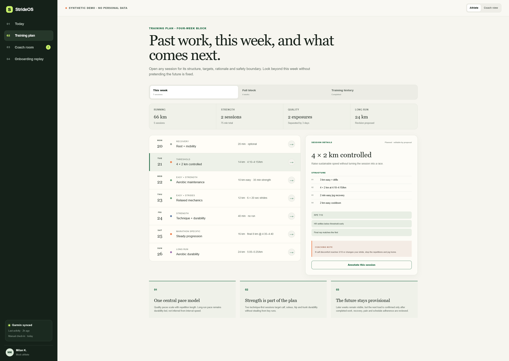

# StrideOS

> An open-source, local-first endurance coaching plugin for ChatGPT Work mode and Codex.

**The model is never the permission system.**

StrideOS is a package of coaching skills—not another training-account app. It helps an athlete build a complete athlete map, use training evidence from tools and accounts they choose, plan running and strength work, use optional fueling support, and create a Training Circle that can be shared with a real coach, experienced runner, or trusted friend.

The athlete stays in control. StrideOS may explain and propose; it does not silently activate a plan, log uncertain food, expand sharing, or perform an external write. The plugin is an editable package, not a central authority over the athlete's computer or accounts.



Built with Codex and GPT-5.6 for OpenAI Build Week 2026. Licensed under MIT.

## Install the plugin

```bash
codex plugin marketplace add Kikser1214/strideos-harness --ref main
codex plugin list
codex plugin add strideos@strideos
```

**Supported surfaces.** According to [OpenAI's plugin documentation](https://learn.chatgpt.com/docs/plugins), installed or workspace-shared plugins work in Work mode on ChatGPT web, in Work mode or Codex in the ChatGPT desktop app, and in Codex CLI—not in Chat mode, the IDE extension, or mobile. Work web cannot read a local folder, and workspace policy may control personal plugins.

To inspect or develop the cloned source locally, register the repository root as the marketplace instead:

```bash
git clone https://github.com/Kikser1214/strideos-harness.git
cd strideos-harness
codex plugin marketplace add .
codex plugin list
codex plugin add strideos@strideos
```

For ChatGPT desktop, restart the app, open **Plugins Directory**, install or enable **StrideOS**, and begin a new Work/Codex task. For Codex CLI, begin a new session after `codex plugin add`. Then try:

> @strideos I want StrideOS to coach me. Start from the beginning and recommend what I should do.

StrideOS skills are explicit-invocation only. This keeps the public plugin's rules out of unrelated personal, work, or coaching tasks unless the athlete deliberately selects `@strideos` or one of its bundled skills.

An installation is a cached snapshot of the source at install time. Editing a fork or local clone does not rewrite an already loaded task: update the plugin version/cachebuster, reinstall that source, restart when required, and begin a new task. See [Ownership, forks, and local extensions](docs/OWNERSHIP_AND_EXTENSIONS.md).

The distributable package lives at [`plugins/strideos`](plugins/strideos). The repository also includes [marketplace metadata](.agents/plugins/marketplace.json) for the ChatGPT desktop plugin directory, following [OpenAI's repository-marketplace format](https://learn.chatgpt.com/docs/build-plugins#marketplace-metadata). The package contains a real `.codex-plugin/plugin.json`, six skills, UI metadata, references, an icon, and its MIT license. It does not claim an MCP server, hosted backend, parser, native companion, or provider integration that it does not ship.

## Six core skills, many coaching workflows

These are broad intent boundaries, not six single-purpose features. Strength, run-walk progression, race planning, method research, provider routes, meal images, training review, scheduled coaching rhythms, dashboard building, and human-coach feedback live inside the relevant core skill so the plugin can route requests without overlapping triggers or conflicting authority rules.

| Skill | What it does |
| --- | --- |
| `strideos:coach-athlete` | Runs first-time onboarding, resumes an athlete relationship, answers “what should I do today?”, and routes work across StrideOS |
| `strideos:plan-training` | Builds and adapts running, run-walk, race, strength, recovery, and cross-training plans; researches named methods before using them |
| `strideos:use-training-data` | Recommends documented provider routes, uses athlete-selected host tools or explicitly supplied local adapters, preserves provenance and freshness, and gates every provider write; tested file parsing lives in the optional reference runtime |
| `strideos:support-fueling` | Provides opt-in loose, guided, detailed, or number-free fueling support, including uncertain meal and fridge images |
| `strideos:schedule-coaching` | Designs optional morning, pre-workout, post-workout, and weekly coaching rhythms; previews and manually tests read-only prompts, then uses the native Scheduled tool when available without claiming installation before confirmation |
| `strideos:build-coach-room` | Builds an athlete-controlled local dashboard or private Site as a Training Circle with scoped human review and athlete-only approval |

The Training Circle is built by the `build-coach-room` skill.

The skills are self-contained enough to use conversationally. This repository also includes a deterministic local reference implementation and two Sites templates so contributors and judges can inspect and test the rules behind the coaching behavior.

## What makes StrideOS different

### A real coach can join the Training Circle

The Training Circle is the central collaboration feature. The athlete decides:

- who is invited;
- which workouts, dates, and fields they can see;
- whether nutrition or body context is included;
- how long access lasts;
- when access is revoked.

A reviewer can comment on an exact workout or week and suggest a structured edit. They cannot activate a plan, invite other people, widen sharing, or operate a provider account. An accepted suggestion becomes a new athlete-visible proposal with a before/after diff; the existing plan stays unchanged until the athlete approves it.

The included [`athlete-coach-demo`](sites/athlete-coach-demo) shows the complete product flow with a clearly synthetic 3:20 marathon runner: detailed history, current week, full plan, annotations, coach comments, revision proposals, and athlete-only approval. Its current identity and persistence are demo-only, so the repository does not describe it as production-private.

### Beginner-first onboarding

StrideOS asks for information only when it can change safety, the recommendation, delivery, or communication:

- current activity, running history, recent load, and useful benchmarks;
- pain, relevant symptoms, injury, conditions, medications, and clearance;
- goal, event date if any, expectations, and motivation;
- realistic schedule, work pattern, sleep, stress, terrain, climate, and barriers;
- strength experience, technique confidence, equipment, preferences, and limitations;
- athlete-selected phone, watch, provider, file, or manual evidence;
- coaching style, optional nutrition, collaboration, automation, and delivery preferences.

Someone who does not know training terminology is not asked to choose among unexplained systems. For a suitable beginner who wants StrideOS to decide, the starting recommendation is three separated run-walk-run sessions, two short technique-first strength sessions, and optional easy cycling when it fits schedule and recovery. Running grows gradually and walking reduces only when pain, recovery, and recent effort support it.

### Training methods are researched, not copied

A request for Norwegian-style threshold work, a run-walk protocol, a regional training tradition, or another named method starts research—it does not bypass the athlete assessment.

StrideOS verifies the exact method with current primary or authoritative sources, identifies the intended population and recovery demand, compares it with the athlete's history and goal, and recommends full use, a conservative adaptation, or rejection. It never treats “Norwegian training” as automatically meaning double threshold or describes “African training” as one universal system.

Strength belongs in every eligible plan. Missed sessions never create catch-up stacking. New pain or safety evidence overrides an approved progression.

### Works alongside the accounts the athlete already has

StrideOS does not say a provider is “connected” because a page is open, a client exists, or an athlete approved an idea. Reads and writes are resolved independently.

StrideOS provides official recommendations; it does not define an allowlist. For a new setup, use this precedence:

1. provider-documented official self-service MCP, API, or user-owned native companion;
2. user-selected attended browser or computer use in the athlete's own visible authenticated session;
3. provider-issued export and supported local file import;
4. manual entry.

The public package ships **no unofficial provider client, private-endpoint recipe, or provider-specific browser executor**. Browser and computer-use tools belong to the host, not to StrideOS. The athlete opens the provider page and performs login and MFA; StrideOS never requests, types, reads, copies, or stores credentials, cookies, session tokens, recovery codes, or browser storage. Browser work is visible, attended, interruptible, and never scheduled or headless.

The upstream route catalog controls what StrideOS recommends, not what an owner may use. Before recommending a new setup, the data skill re-checks current first-party provider sources and detects whether the current ChatGPT, Work, Codex, or other AI surface actually exposes attended browser/computer use. If an athlete explicitly chooses an existing local script, another plugin, or another external host capability, StrideOS's provider-route guidance steps aside. The agent handles that capability as if StrideOS were absent, subject to host permissions and ordinary exact approval for writes. Upstream does not bundle, describe, certify, or support that external capability.

#### Current provider truth

These are the public routes the skill can explain or help the athlete configure, not bundled integrations. This release includes no provider client, MCP server, native companion, provider-specific browser executor, or file parser inside the plugin package. The optional reference runtime separately parses its tested FIT, GPX, TCX, and CSV inputs.

| Provider | Official route StrideOS recommends | Important limit |
| --- | --- | --- |
| Garmin Connect | Official export + file import; attended browser session in the athlete's own login (reads, and writes via one-use approval) when the host provides browser use | Official API is business-reviewed; StrideOS ships no Garmin client and never handles credentials |
| Strava | Official Strava MCP where available; athlete-initiated export; manual check-in | Prefer the official MCP for structured reads |
| Apple Health / Watch | Authorized iOS companion; manual check-in | HealthKit/WorkoutKit and per-type system permission require a native companion |
| Android Health Connect | Authorized Android companion; manual check-in | On-device authorization and a native companion are required |
| Fitbit / Google Health | Official API setup or athlete export with required disclosure and consent; manual check-in | Restricted scopes and model-use consent must be enforced |
| Oura | Official Oura MCP when compatible; manual subjective entry | Keep current model-use and retention requirements visible |
| WHOOP | Official API/export after current consent, retention, and model-use review; manual subjective entry | Do not teach an unofficial connector |
| Polar | Official API setup where permitted, official export, or manual entry | Do not imply a write until the selected route proves it |
| COROS | Official read-only MCP, official export, or manual entry | MCP reads are preferred; it does not create workouts |
| Suunto | Official export or manual entry | Cloud API access is partner-oriented |

Attended browser/computer use is a host capability the athlete may choose for any provider; see 'Works alongside the accounts the athlete already has' above.

The source-backed upstream recommendation catalog is [`rules/connector-playbooks.json`](rules/connector-playbooks.json). It records capability, model-context considerations, route status, first-party sources, limitations, and review date. It is not an enforcement boundary for a fork or an explicitly supplied local adapter.

### Every write is exact and one-use

A real host tool, official connector, companion, or explicitly supplied local adapter must exist before approval is offered. A provider write preview is bound to the provider, route, account, capability, operation, context, exact payload, athlete state, and expiry. One approval authorizes one write.

Expired, altered, mismatched, replayed, scheduled, headless, or unattended attempts stop. After a tool reports success, StrideOS still requires visible verification of exactly one write before it calls the action performed. The checked-in Garmin-shaped reference action remains explicitly simulation only; host browser/computer use and user-supplied adapters are separate capabilities outside that simulator.

### Nutrition stays optional and practical

The fueling skill supports `off`, `loose`, `guided`, `detailed`, and `number_free` modes. Number-free preference, under-18 status, a relevant tracking concern, `do_not_use` weight context, and clinician-prescribed constraints override detailed tracking.

Meal and fridge photos are estimates. A photo cannot prove ingredients, portions, allergens, cooking fats, cross-contact safety, or nutritional values. The athlete corrects and confirms the normalized record before logging, and the bundled state never retains the raw image.

Body measurements and images are optional. StrideOS does not infer a diagnosis, body-fat percentage, health status, performance potential, or moral judgment from appearance.

## The control loop

StrideOS keeps model reasoning separate from authority:

1. **Sense** — use only athlete-authorized evidence and preserve source and freshness.
2. **Reason** — combine deterministic analysis with optional GPT-5.6 explanation or image reasoning.
3. **Gate** — check the intended action against current athlete state, the selected tool's real capability, host permissions, and the installed package's configured rules.
4. **Propose** — show the exact recommendation or state change and explain why.
5. **Approve or stop** — activate only the exact approved local change; external writes additionally need a real selected tool and one exact approval.
6. **Verify** — call an action performed only after its resulting state is read back or visibly attested.

## Post-Build Week roadmap

These are research directions, not features in the current release, and they carry no promised delivery date. The goal is to extend the current approval-gated coaching loop across longer time horizons while keeping retention visible, optional, and athlete controlled.

- **Longitudinal athlete memory** — connect completed sessions, morning and evening check-ins, symptoms, recovery, fueling, environment, and athlete notes across weeks, months, and seasons. Recurring patterns—such as a side stitch appearing under particular combinations of load, heat, timing, or fueling—should be surfaced as testable hypotheses, never diagnoses or claims of causation.
- **Training response analysis** — compare what was planned with what was completed, what felt sustainable, and what repeatedly produced useful adaptation over one-to-three-week, two-to-three-month, and annual windows. Preserve missing-data and confidence limits instead of manufacturing certainty.
- **Running form over time** — compare athlete-supplied running videos or images, label observations with uncertainty, suggest practical form or strength work when useful, and track whether later evidence supports the intervention. This remains movement feedback, not medical assessment.
- **Flexible fueling and body context** — let each athlete choose anything from simple meal photos to confirmed macro tracking, then examine longer-term relationships with training and recovery. Optional progress images or measurements must never be used to infer an exact body-fat percentage, diagnosis, health status, performance potential, or moral judgment from appearance.

The roadmap does not change the current authority model: an insight is evidence for a conversation, not permission to alter a plan, retain new data, expand sharing, or perform an external write.

## Run the optional local reference implementation

The plugin does not require the web reference implementation. Use it when you want to inspect the deterministic state machine, onboarding, dashboard, imports, nutrition confirmation, decisions, and tests.

```bash
npm run setup
```

On Windows:

```powershell
npm.cmd run setup
```

Open <http://localhost:4173>. The first page is real onboarding; synthetic demo data is never silently loaded as a personal athlete.

Useful commands:

```bash
npm run doctor
npm run verify
npm run test:plugin
npm run reset
npm run brief -- --kind morning_brief
```

- `doctor` checks Node, dependencies, environment syntax, state permissions, privacy artifacts, and clean-install requirements without printing secret values.
- `verify` runs diagnostics, syntax checks, and the complete acceptance suite.
- `test:plugin` checks the plugin manifest, six skills, official-recommendation language, installed ownership, and unofficial-recipe regression guards.
- `reset` clears the configured local athlete state and returns to a true first run.
- `brief` produces a read-only payload for an optional scheduled prompt; it never changes a plan or provider account.

The deterministic experience needs no wearable, provider account, database, deployment, or OpenAI key. Optional GPT-5.6 mode uses a server-side `OPENAI_API_KEY` only after the athlete enables cloud processing; deterministic safety and permission rules remain authoritative.

## Repository map

```text
plugins/strideos/                     Installable StrideOS plugin package
  .codex-plugin/plugin.json          Plugin manifest and UI metadata
  skills/coach-athlete/              Onboarding and coaching orchestration
  skills/plan-training/              Training plans and method research
  skills/use-training-data/          Provider routes, imports, and provenance
  skills/support-fueling/            Optional fueling and photo boundaries
  skills/schedule-coaching/          Preview-first scheduled coaching rhythms
  skills/build-coach-room/           Training Circle collaboration
rules/onboarding-schema.json         First-run question inventory
rules/connector-playbooks.json       Source-backed official recommendation catalog
rules/harness-policy.json            Deterministic action boundaries
src/                                 Local reference engine and HTTP API
public/                              Local reference interface and PWA assets
sites/athlete-coach-demo/            Synthetic Training Circle product template
sites/strideos-landing/              Public project website
docs/                                Architecture, install, research, demo, and release guides
test/                                Unit, HTTP, provider-policy, and plugin-package tests
```

The repository retains its original GitHub URL, `strideos-harness`, but the shipped product is the **StrideOS plugin package**. `src/harness.mjs` is the internal deterministic decision gate, not the product identity.

## Verification evidence

The release gate includes:

- current strict portable validation of the final plugin, six skills, route-safety language, and repository marketplace metadata;
- official Codex validation of the same manifest and skill metadata during packaging, including the installed plugin copy;
- the Codex marketplace listing showing the `strideos@strideos` plugin and package validation proving its six-skill inventory;
- an isolated successful Codex install using a relative local path;
- root diagnostics, syntax checks, and the complete Node acceptance suite;
- landing-site build and rendered-page test;
- athlete-and-coach site build and rendered-page tests;
- a production dependency audit refreshed on July 20, 2026 with zero findings;
- `git diff --check`.

Coverage includes beginner onboarding, safety stops, strength recommendations, training-plan approval and replay protection, workout annotations, nutrition confirmation, imports and freshness, provider route recommendations, attended-session boundaries, user-supplied adapter handling, one-use expiring write envelopes, private-companion access control, and plugin packaging.

## Important current boundaries

- StrideOS provides general wellness coaching, not diagnosis or treatment.
- No unofficial provider client, private-endpoint recipe, or provider-specific browser executor ships in this release. Attended host browser/computer use and explicitly supplied local adapters remain available when the user chooses them and the host permits them.
- The Training Circle Site is a product template until real identity, private persistence, invitations, and revocation are bound to a production surface.
- Scheduled tasks may summarize and ask questions; they cannot browse a provider, activate a plan, log food, or perform an external write.
- The repository contains synthetic athlete data only.

Read [`PRIVACY.md`](PRIVACY.md) before hosting a personal instance.

## Documentation

- [Clean-clone and plugin installation](docs/INSTALL.md)
- [Ownership, forks, and local extensions](docs/OWNERSHIP_AND_EXTENSIONS.md)
- [Cloud Work new-user and presentation test](docs/CLOUD_WORK_TEST.md)
- [Architecture](docs/ARCHITECTURE.md)
- [Build plan](docs/BUILD_PLAN.md)
- [Provider access routes](docs/SELF_SERVICE_CONNECTORS.md)
- [Data access and provenance](docs/DATA_CONNECTIONS.md)
- [Onboarding research](docs/ONBOARDING_RESEARCH.md)
- [Training-plan engine](docs/TRAINING_PLAN_ENGINE.md)
- [Nutrition companion](docs/NUTRITION_COMPANION.md)
- [Dashboard contract](docs/DASHBOARD.md)
- [Automations](docs/AUTOMATIONS.md)
- [ChatGPT Work and Sites](docs/CHATGPT_SITES.md)
- [Judge guide](docs/JUDGING_GUIDE.md)
- [Demo video script](docs/VIDEO_SCRIPT.md)
- [Release checklist](docs/RELEASE_CHECKLIST.md)

## Open source

StrideOS is licensed under the [MIT License](LICENSE). Garmin's FIT SDK keeps its own license and is not relicensed by this project; see [Third-party notices](THIRD_PARTY_NOTICES.md).

Contributions are welcome for coaching skills, training-method research, deterministic safety, provider guidance, data normalization, privacy, testing, and human-coach collaboration. The upstream project documents official routes and never publishes unofficial access recipes; its recommendations are not an allowlist. The MIT-licensed source may be forked and changed, and user-selected scripts, plugins, browser tools, computer use, and local adapters remain outside upstream enforcement.
