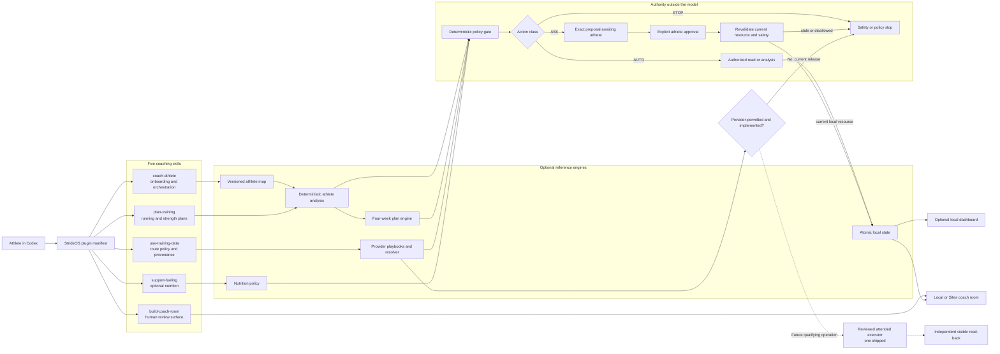

# StrideOS architecture

StrideOS ships as an installable five-skill plugin for ChatGPT Work mode and Codex. The plugin is the product; the Node/PWA, deterministic engines, and Sites projects in this repository are optional reference implementations that make its rules testable and its coach-room experience visible.

The architecture separates model reasoning from authority. A skill may gather context, explain, and propose. Deterministic policy owns state transitions. Provider access is capability-specific and may use only a current first-party route that permits the intended individual and model use.

No provider browser or write executor ships in this release. An approval cannot create a missing route.

## Plugin package

`plugins/strideos/.codex-plugin/plugin.json` is the distribution boundary. It declares five skills and accurate UI metadata. It deliberately declares no MCP server or app because none is bundled.

| Skill | Authority |
| --- | --- |
| `coach-athlete` | Gathers the athlete map, applies safety boundaries, recommends a starting frame, and routes focused work |
| `plan-training` | Researches method fit and drafts or adapts training; never activates its own proposal |
| `use-training-data` | Resolves provider, file, native companion, and manual routes; preserves provenance; stops prohibited or unimplemented operations |
| `support-fueling` | Provides opt-in practical nutrition; keeps images and numeric estimates uncertain until confirmed |
| `build-coach-room` | Builds the athlete-controlled view where reviewers comment and suggest without plan or provider authority |

Each skill includes a concise `SKILL.md`, OpenAI UI metadata, and a focused reference. The package is self-contained for conversational use; the reference application is not required to install it.

## Optional local reference implementation

The local Node/PWA proves deterministic behavior:

- first-run onboarding and safety gates;
- athlete analysis and training-plan proposals;
- explicit plan activation and decline;
- imports, manual check-ins, provenance, and freshness;
- optional fueling and image-confirmation policy;
- workout annotations and revision proposals;
- scheduled-prompt previews with no unattended writes;
- decision persistence, expiry, replay rejection, and corrupt-state recovery.

Synthetic judge data is always labeled. It is never substituted for a personal athlete.

## Provider route resolver

Resolve each provider and capability independently:

1. official self-service MCP, API, or user-owned native companion that permits the intended individual and model use;
2. attended browsing only when current provider rules permit the exact operation and a reviewed executor is enabled;
3. provider-issued export with a supported local parser;
4. manual entry.

Data-access permission and model-context permission are separate. Provider identity, route, purpose, required disclosure, consent, and freshness must survive normalization. A partner-only, policy-blocked, unsourced, stale, unimplemented, or incompatible model-context route is not selectable.

Garmin currently resolves to an athlete-selected official export with a supported local file or manual entry. Strava API-to-AI use and signed-in browser automation are blocked under the reviewed policy. Oura provider data is MCP-only for LLM use and no compatible setup is currently enabled. WHOOP provider-data model use remains fail-closed.

## Future attended-provider boundary

This is a dormant contract, not a current feature:

- the provider must permit the exact individual-user operation;
- a reviewed executor must be implemented and enabled for that route;
- the athlete opens the provider site and performs login and MFA;
- credentials, cookies, tokens, recovery codes, raw HTML, and browser storage are never requested or retained;
- browsing remains visible, attended, interruptible, and unavailable to Scheduled or headless work;
- a read stores only normalized values, provider/route provenance, observation and retrieval time, and freshness;
- a write begins with a non-mutating preview bound to provider, route, visible account, operation, target, exact payload, athlete/plan version, and expiry;
- one approval is atomically claimed for one write and cannot be replayed;
- a separate post-write inspection must visibly verify the intended result before StrideOS calls it performed;
- account mismatch, UI drift, changed safety/plan state, expiry, or an extra write stops execution.

## Coach-room boundary

The athlete owns sharing. A reviewer receives only the approved fields and date range. Comments attach to immutable workout, week, or plan snapshots. A suggested edit becomes a new before/after proposal. Reviewers cannot activate plans, invite others, widen sharing, or operate provider accounts.

`sites/athlete-coach-demo` demonstrates the interaction with synthetic data. Production privacy still requires bound identity, a reviewer allowlist, durable private persistence, access expiry, revocation, and audit history on the selected hosting surface.

## Runtime modes

| Mode | GPT-5.6 | State | Provider behavior |
| --- | --- | --- | --- |
| Installed StrideOS plugin | Product-surface dependent | Athlete-authorized conversational context | Skills apply current route and approval policy; no bundled executor |
| Zero-setup judge trace | Off | Labeled synthetic fixture | Fixture reads; provider writes always simulated |
| Personal local reference | Off | Completed local athlete map | Supported file/manual/local reads; no provider writes |
| Live reference reasoning | On after cloud opt-in and provider model-use checks | Bounded permitted athlete context | Still no implicit provider authority |
| Generated coach room | Optional | Athlete-approved projection | No provider session, credential, or provider action |
| Scheduled brief | Optional | Read-only local projection | No attended browsing, plan activation, food log, or external write |
| Future attended provider session | Optional | Current validated athlete state plus an exact qualifying route | Dormant until provider permission and reviewed executor both exist |

## Trust boundaries

1. The model is not the permission system.
2. The athlete owns authentication, sharing, plan activation, and every external write decision.
3. Provider permission, model-use permission, implementation, and athlete approval are independent gates.
4. Planned work, observed activity, and athlete-confirmed completion stay separate.
5. New pain or safety evidence invalidates older progression and write proposals.
6. Raw provider pages, credentials, session material, raw activity request bytes, and raw meal images are not retained by the bundled state.
7. Sites cannot reuse a provider session or execute a provider action.
8. Unknown actions stop by default.
