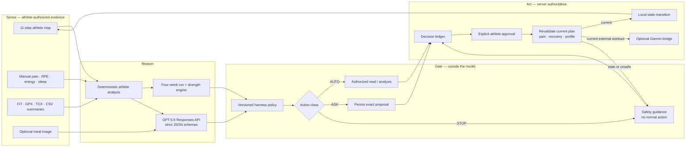

# StrideOS architecture

StrideOS separates model reasoning from authority. The model may explain and propose; deterministic server code owns state transitions and external side effects.

## Trust boundaries

1. **The model is not the permission system.** GPT-5.6 returns schema-constrained evidence, confidence, an intended action, and explanatory text. It cannot activate plans, log food, schedule workflows, or write to a device.
2. **The server authors the resource.** A plan approval points to the exact persisted plan. A Garmin approval contains the exact plan ID, session ID, date, duration, intensity, and steps generated from the active server state.
3. **Approval is revalidated.** New pain, safety, profile, or plan evidence invalidates an older workout proposal before any bridge request.
4. **Judge data stays synthetic.** The no-setup fixture is labeled and is always simulated, even if a Garmin bridge URL exists.
5. **Raw inputs are minimized.** Raw activity files and raw meal images are not retained by the included store. Normalized records are visible and deletable.

## Runtime modes

| Mode | GPT-5.6 | Athlete state | External Garmin write |
| --- | --- | --- | --- |
| Zero-setup judge trace | Off | Labeled synthetic fixture | Always simulated |
| Personal local demo | Off | Completed local athlete map | Simulated unless an exact current workout and bridge are configured |
| Live reasoning | On, after cloud opt-in | Completed local athlete map sent as bounded context | Still requires exact persisted approval and revalidation |

The dashboard, nutrition companion, automation previews, and decision ledger all read from the same server-authoritative state; the browser never activates a client-supplied resource.
