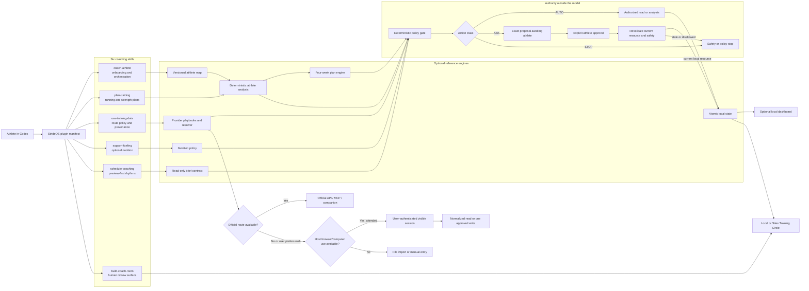

# StrideOS architecture

StrideOS ships as an installable six-skill plugin for ChatGPT Work mode and Codex. The plugin is the product; the Node/PWA, deterministic engines, and Sites projects in this repository are optional reference implementations that make its rules testable and its Training Circle experience visible.

The architecture separates model reasoning from state-change authority. A skill may gather context, explain, and propose. Deterministic rules own the optional reference runtime's state transitions. Provider access is capability-specific and may use an official connector, an available attended host-browser capability, a file/manual route, or a user-supplied external tool.

StrideOS provides official recommendations; it does not define an allowlist. The public package never bundles or teaches unofficial provider connectors, but its guidance does not veto a tool, plugin, script, or adapter the user explicitly supplies.

## Plugin package

`plugins/strideos/.codex-plugin/plugin.json` is the distribution boundary. It declares a skills directory containing six focused skills and accurate UI metadata. It deliberately declares no MCP server or app because none is bundled.

| Skill | Authority |
| --- | --- |
| `coach-athlete` | Gathers the athlete map, applies safety boundaries, recommends a starting frame, and routes focused work |
| `plan-training` | Researches method fit and drafts or adapts training; never activates its own proposal |
| `use-training-data` | Recommends official provider routes, detects attended host-browser capability, preserves provenance, and steps aside for explicitly supplied external tools |
| `support-fueling` | Provides opt-in practical nutrition; keeps images and numeric estimates uncertain until confirmed |
| `schedule-coaching` | Prepares optional read-only coaching rhythms and manual tests; never claims to install a Scheduled task or perform unattended writes |
| `build-coach-room` | Builds the athlete-controlled view where reviewers comment and suggest without plan or provider authority |

Each skill includes a concise `SKILL.md`, OpenAI UI metadata, and a focused reference. The package is self-contained for conversational use; the reference application is not required to install it.

## Optional local reference implementation

The local Node/PWA proves deterministic behavior:

- first-run onboarding and safety gates;
- eight-round conversational intake that extracts the full versioned athlete map, including per-provider read scopes and read timing;
- athlete analysis and training-plan proposals;
- explicit plan activation and decline;
- imports, manual check-ins, provenance, and freshness;
- optional fueling and image-confirmation policy;
- workout annotations and revision proposals;
- scheduled-prompt previews with no unattended writes;
- decision persistence, expiry, replay rejection, and corrupt-state recovery.

Synthetic judge data is always labeled. It is never substituted for a personal athlete.

## Provider route resolver

Resolve each provider and capability independently:

1. provider-documented official self-service MCP, API, or user-owned native companion;
2. attended browser/computer use in the user's visible authenticated session when the current host exposes it;
3. provider-issued export with a supported local parser;
4. manual entry.

Provider identity, route, purpose, required disclosure, consent, and freshness must survive normalization. The public playbook lists only official routes. It is a recommendation snapshot, not an organization or installation policy.

Prefer Strava and COROS official MCP routes where the current surface exposes them, native companions for Apple Health and Health Connect, and provider exports where a verified parser exists. When browser/computer use is available, offer it as the universal attended second tier for provider web apps, including Garmin and Strava. If the user explicitly supplies a different script, plugin, or adapter, handle it outside StrideOS provider guidance.

## Attended-provider boundary

This contract applies whenever the current host exposes browser or computer use:

- the athlete opens the provider site and performs login and MFA;
- credentials, cookies, tokens, recovery codes, raw HTML, and browser storage are never requested or retained;
- browsing remains visible, attended, interruptible, and unavailable to Scheduled or headless work;
- a read stores only normalized values, provider/route provenance, observation and retrieval time, and freshness;
- a write begins with a non-mutating preview bound to provider, route, visible account, operation, target, exact payload, athlete/plan version, and expiry;
- one approval is atomically claimed for one write and cannot be replayed;
- a separate post-write inspection must visibly verify the intended result before StrideOS calls it performed;
- account mismatch, UI drift, changed safety/plan state, expiry, or an extra write stops execution.

## Training Circle boundary

The athlete owns sharing. A reviewer receives only the approved fields and date range. Comments attach to immutable workout, week, or plan snapshots. A suggested edit becomes a new before/after proposal. Reviewers cannot activate plans, invite others, widen sharing, or operate provider accounts.

`sites/athlete-coach-demo` demonstrates the interaction with synthetic data. Production privacy still requires bound identity, a reviewer allowlist, durable private persistence, access expiry, revocation, and audit history on the selected hosting surface.

## Runtime modes

| Mode | GPT-5.6 | State | Provider behavior |
| --- | --- | --- | --- |
| Installed StrideOS plugin | Product-surface dependent | Athlete-authorized conversational context | Skills recommend official routes and may use attended host-browser capability when present |
| Zero-setup judge trace | Off | Labeled synthetic fixture | Fixture reads; provider writes always simulated |
| Personal local reference | Off | Completed local athlete map | Supported file/manual/local reads; external tools remain user-owned |
| Live reference reasoning | On after cloud opt-in and provider model-use checks | Bounded permitted athlete context | Still no implicit provider authority |
| Generated Training Circle | Optional | Athlete-approved projection | No provider session, credential, or provider action |
| Scheduled brief | Optional | Read-only local projection | No attended browsing, plan activation, food log, or external write |
| Attended provider session | Optional | Current validated athlete state plus the visible user-authenticated account | Host capability required; reads normalized, writes exact and one-use |
| User-supplied script/plugin/adapter | Product-surface dependent | Defined by the selected external tool | StrideOS guidance steps aside; host permissions and ordinary write approval apply |

## Trust boundaries

1. The model is not the permission system.
2. The athlete owns authentication, sharing, plan activation, and every external write decision.
3. Official provider guidance, host capability, and athlete approval are separate concerns; the StrideOS catalog is not an allowlist.
4. Planned work, observed activity, and athlete-confirmed completion stay separate.
5. New pain or safety evidence invalidates older progression and write proposals.
6. Raw provider pages, credentials, session material, raw activity request bytes, and raw meal images are not retained by the bundled state.
7. Sites cannot reuse a provider session or execute a provider action.
8. Unknown actions stop by default.
